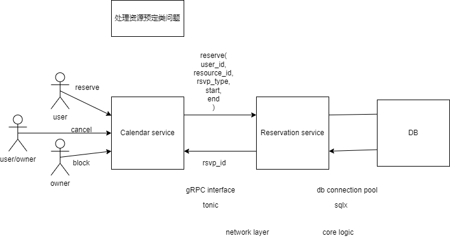
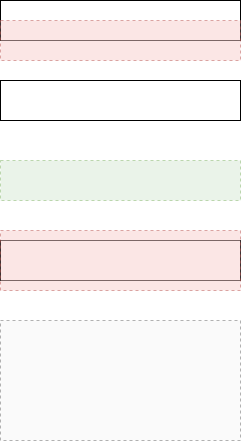
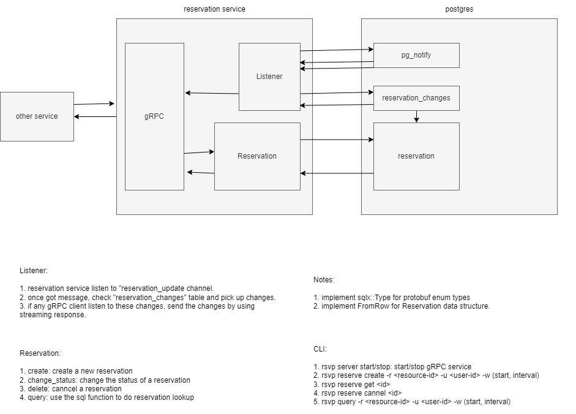

# Core Reservation Service

- Feature Name: core-reservation-service
- Start Date: 2023-05-04 14:27:53

## Summary

[summary]: #summary

A core reservation service that solve the problem of reserving a resource for a period of time. We leverage PostgreSQL EXCLUDE constracaints to ensure that only one reservation can be made for a given resource at a given time.

## Motivation

[motivation]: #motivation

We need a common solution for various reservation requirements: 1) calendar booking; 2) hotel/room booking; 3) meeting room booking; 4) parking lot booking; 5) etc.

## Guide-level explanation

[guide-level-explanation]: #guide-level-explanation

Basic architecture:



### Service interface

We would use gRPC as a service interface. Below is proto definition:

```proto

enum ReservationStatus {
    UNKNOWN = 0;
    PENDING = 1;
    CONFIRMED = 2;
    BLOCKED = 3;
}

enum ReservationUpdateType {
    UNKNOWN = 0;
    CREATE = 1;
    UPDATE = 2;
    DELETE = 3;
}

message Reservation {
    string id = 1;
    string user_id = 2;
    ReservationStatus status = 3;

    // resource reservation window
    string resource_id = 4;
    google.protobuf.Timestamp start = 5;
    google.protobuf.Timestamp end = 6;

    // extra note
    string note = 7;
}

message ReserveRequest {
    Reservation reservation = 1;
}

message ReserveResponse {
    Reservation reservation = 1;
}

message ConfirmRequest {
    string id = 1;
}

message ConfirmResponse {
    Reservation reservation = 1;
}

message UpdateRequest {
    string note = 1;
}

message UpdateResponse {
    Reservation reservation = 1;
}

message CancelRequest {
    string id = 1;
}

message CancelResponse {
    Reservation reservation = 1;
}

message GetRequest {
    string id = 1;
}

message GetResponse {
    Reservation reservation = 1;
}

message QueryRequest {
    string resource_id = 1;
    string user_id = 2;
    // user status to filter result, If UNKNOWN, return all reservations
    ReservationStatus status = 3
    google.protobuf.Timestamp start = 4;
    google.protobuf.Timestamp end = 5;
}

message ListenRequest {

}

message ListenResponse {

}

service ReservationService {
    rpc reserve(ReserveRequest) returns (ReserveResponse);
    rpc confirm(ConfirmRequest) return (ConfirmResponse);
    rpc update(UpdateRequest) returns (UpdateResponse);
    rpc cancel(CancelRequest) returns (CancelResponse);
    rpc get(GetRequest) returns (GetResponse);
    rpc query(QueryRequest) returns (stream Reservation);

    // another system could monitor newly added/confirmed/cancelled reservations
    rpc listen(ListenRequest) returns (ListenResponse);
}
```

### Database schema

We use postgres as the database. Below is the schema:

```sql
CREATE SCHEME rsvp;
CREATE TYPE  rsvp.reservation_status AS ENUM ('unknown', 'pending', 'confirmed', 'blocked');
CREATE TYPE  rsvp.reservation_update_type AS ENUM ('unknown', 'create', 'update', 'delete');

CREATE TABLE rsvp.reservations {
    id uuid NOT NULL DEFAULT uuid_generate_v4(),
    user_id varchar(64) NOT NULL,
    status rsvp.reservation_status NOT NULL DEFAULT 'pending',

    resource_id varchar(64) NOT NULL,
    timespan tstzrange NOT NULL,

    note text,
    create_at timestamp with time zone NOT NULL DEFAULT now(),
    update_at timestamp with time zone NOT NULL DEFAULT now(),

    CONSTRAINT reservations_pkey PRIMARY KEY (id),
    CONSTRAINT reservations_conflict EXCLUDE USING gist (resource_id WITH =, timespan WITH &&)
};

CREATE INDEX reservations_resource_id_idx ON rsvp.reservations (resource_id);
CREATE INDEX reservations_user_id_idx ON rsvp.reservations (user_id);

-- if user_id is null, find all reservations within during for the resource
-- if resource_id is null, find all reservations within during for the user
-- if both are null, find all reservations within during
-- if both set, find all reservations within during for the resource and user
CREATE OR REPLACE FUNCTION rsvp.query(uid text, rid text, during: TSTZRANGE) RETURNS TABLE rsvp.reservations AS $$ $$ LANGUAGE plpgsql;

-- reservation change queue
CREATE TABLE rsvp.reservation_changes {
    id SERIAL NOT NULL,
    reservation_id NOT NULL,
    op rsvp.reservation_update_type NOT NULL,
};

-- trigger for add/update/delete reservation
CREATE OR REPLACE FUNCTION rsvp.reservation_trigger() RETURNS TRIGGER AS
$$
BEGIN
    IF TG_OP = 'INSERT' THEN
        INSERT INTO rsvp.reservation_changes (reservation_id, op) VALUES (NEW.id, 'create');
    ELSEIF TG_OP = 'UPDATE' THEN
        IF OLD.status <> NEW.status THEN
            INSERT INTO rsvp.reservation_changes (reservation_id, op) VALUES (NEW.id, 'UPDATE');
        END IF;
    ELSEIF TG_OP = 'DELETE' THEN
        INSERT INTO rsvp.reservation_changes (reservation_id, op) VALUES (NEW.id, 'delete');
    END IF;

    NOTIFY reservation_update;
    RETURN NULL;
END;
$$ LANGUAGE plpgsql;

CREATE TRIGGER reservations_trigger
    AFTER INSERT OR UPDATE OR DELETE ON rsvp.reservations
    FOR EACH ROW EXECUTE PROCEDURE rsvp.reservation_trigger()
```

Here we use EXCLUDE constraint provided by postgres to ensure that on overlapping reservations cannot be mad for a given resource at given time.

```sql
CONSTRAINT reservations_conflict EXCLUDE USING gist (resource_id WITH =, timespan WITH &&)
```



We also use a triiger to notify a channel when a reservation is added/updated/deleted. To make sure even we missed certain messages from the channel when DB connection is down for some reason, we use a queue to store reservation changes. Thus when we receive a notification, we can query the queue to get all the changes since last time we checked, and once we finished processing all the changes, we can delete them from the queue.

### Core flow



## Reference-level explanation

[reference-level-explanation]: #reference-level-explanation

TODO

## Drawbacks

[drawbacks]: #drawbacks

N/A

## Rationale and alternatives

[rationale-and-alternatives]: #rationale-and-alternatives

N/A

## Prior art

[prior-art]: #prior-art

N/A

## Unresolved questions

[unresolved-questions]: #unresolved-questions

N/A

## Future possibilities

[future-possibilities]: #future-possibilities

N/A
